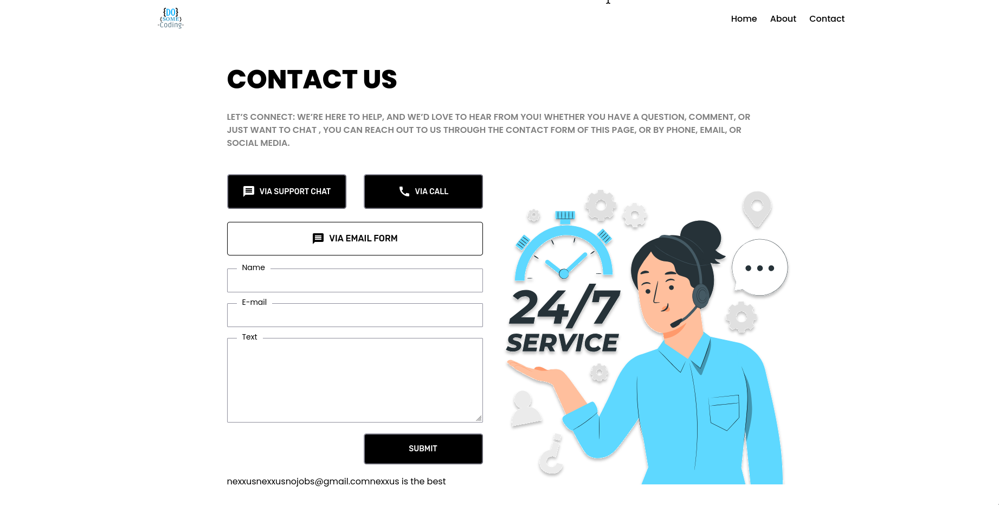

# Support Page (React + Vite)

A simple **React + Vite** project built by following a tutorial.  
This app demonstrates a support/contact page where anything typed into the form fields is **instantly displayed** on the page below.

---

## 🚀 Features
- Built with **React** and **Vite** for super fast development.
- Contact form with live preview (whatever you type gets printed below).
- Organized component-based structure.
- Customizable styles with CSS modules.
---

## 📸 Screenshots
Here’s how the app looks:



*(Add more screenshots if you want — just drop them in `public/` and reference like above.)*

---

## ⚡ Getting Started

### 1. Clone the repo
```bash
git clone https://github.com/nexxus314/Support_Page-React-Project-2-.git
cd Support_Page-React-Project-2-
2. Install dependencies

npm install

3. Run the development server


npm run dev

Now open [http://localhost:5173](http://localhost:5173) in your browser 🚀

4. Build for production


npm run build

## 🛠️ Tech Stack
- [React](https://react.dev/)
- [Vite](https://vitejs.dev/)
- [JavaScript (ES6+)](https://developer.mozilla.org/en-US/docs/Web/JavaScript)

---

## 🙌 Acknowledgements
- Built by following a React + Vite tutorial.